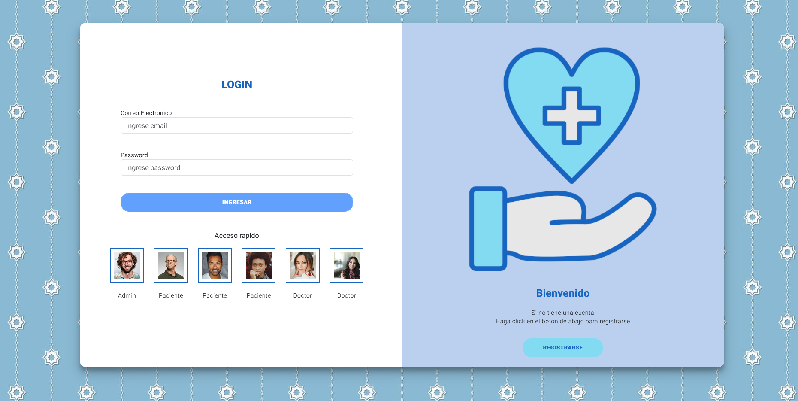
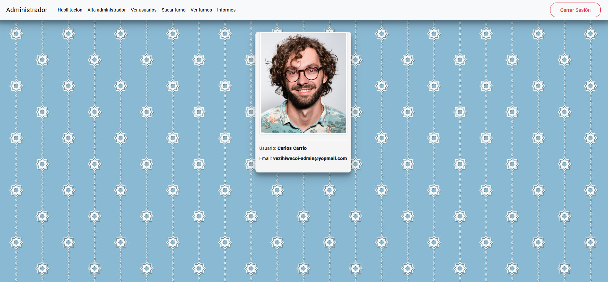
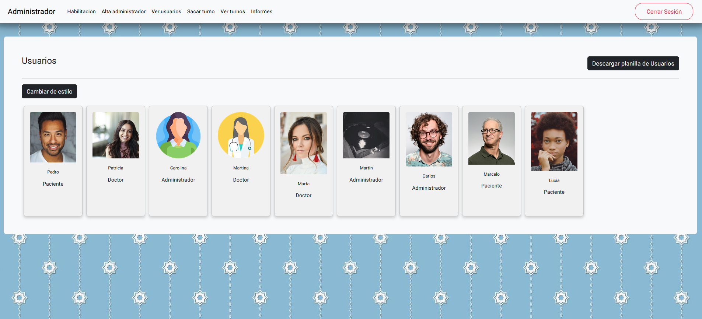
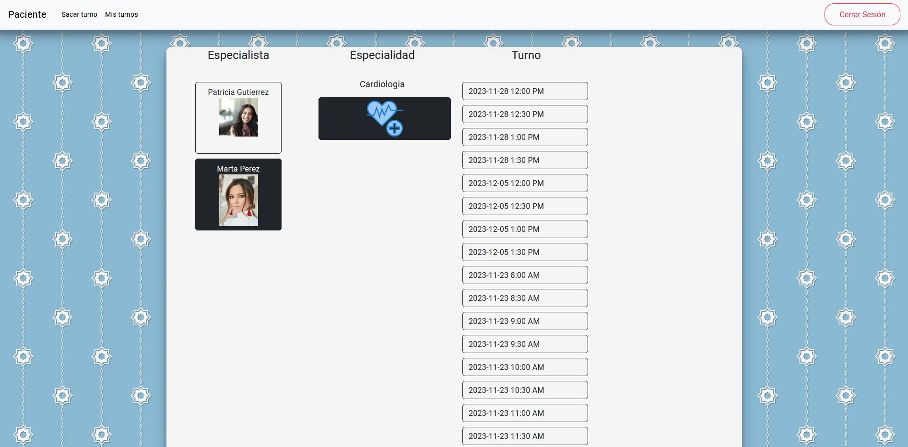

# TP-ClinicaOnline

La clínica OnLine, especialista en salud, cuenta actualmente con consultorios (6 en la actualidad),
dos laboratorios (físicos en la clínica), y una sala de espera general. Está abierta al público de lunes a
viernes en el horario de 8:00 a 19:00, y los sábados en el horario de 8:00 a 14:00.
Trabajan en ella profesionales de diversas especialidades, que ocupan los consultorios acorde a su
disponibilidad, y reciben en ellos pacientes con turno para consulta o tratamiento. Dichos turnos son
pedidos por esta pagina seleccionando el profesional o la especialidad.

## Pantallas

### Ingresar

En esta seccion puede ingresar a la pagina
Debajo se encuentran los accesos rapidos

### Registrarse

En esta seccion puede registrarse en la pagina
Los formularios de registro varian entre Paciente y Especialista

### Perfil

Pagina principal de perfil del Admin

Pagina principal de perfil del Especialista

Pagina principal de perfil del Paciente

### Turnos

Todos los turnos pueden visualizarse ingresando como Admin

Cada Especialista puede visualizar solo sus propios turnos

Cada Paciente puede visualizar solo sus propios turnos

## Administrador
El Administrador puede acceder a...

### Administrador:

En esta seccion el administrador ve sus datos personales

### Habilitacion:

En esta seccion el administrador puede ver el listado de Especialistas con la opcion de habilitar/deshabilitar al mismo

### Alta administrador:

En esta seccion el administrador puede registrar a un administrador

### Ver usuarios:

En esta seccion el administrador puede ver todos los usuarios

### Sacar turno:

En esta seccion el administrador puede solicitarle un turno a cualquiera de los pacientes de la clinica

### Ver turnos:

En esta seccion el administrador puede ver todos los turnos de la clinica y cancelar los mismos, dejando un comentario del motivo
Tiene un filtro que le permite buscar por especialista y especialidad

## Especialista
El Especialista puede acceder a...

### Especialista:

En esta seccion el especialista ve sus datos personales y puede asignar sus horarios de trabajo para cada una de sus especialidades

### Pacientes:

En esta seccion el especialista puede ver la informacion de sus pacientes (pacientes que se atendieron con el minimo 1 vez)

### Turnos:

En esta seccion el especialista ve todos los turnos que tiene asignados, los cuales puede aceptar, rechazar, finalizar o cancelar.
Tambien al finalizar un turno debe llenar un formulario de diagnostico y ,en caso de cancelar/rechazar, debe dejar un comentario del motivo

## Paciente
El Paciente puede acceder a...

### Paciente:

En esta seccion el paciente ve sus datos personales

### Sacar Turno:

En esta seccion el paciente puede solicitar turnos medicos. Debe seleccionar alguna de las especialidades disponibles en la Clinica, al seleccionarla se le muestra los especialistas y sus turnos disponibles.

### Mis Turnos:

En esta seccion el paciente ve todos sus turnos, los cuales puede cancelar en caso de ser necesario dejando un comentario del motivo. Tambien, al finalizar el mismo se le da la opcion de calificar la atencion del especialista y de ver la reseña del turno.
Tiene un filtro que le permite buscar por cualquier campo del Turno.
